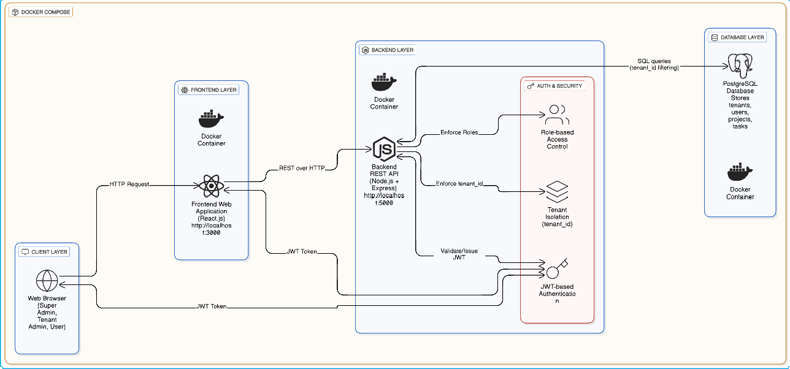
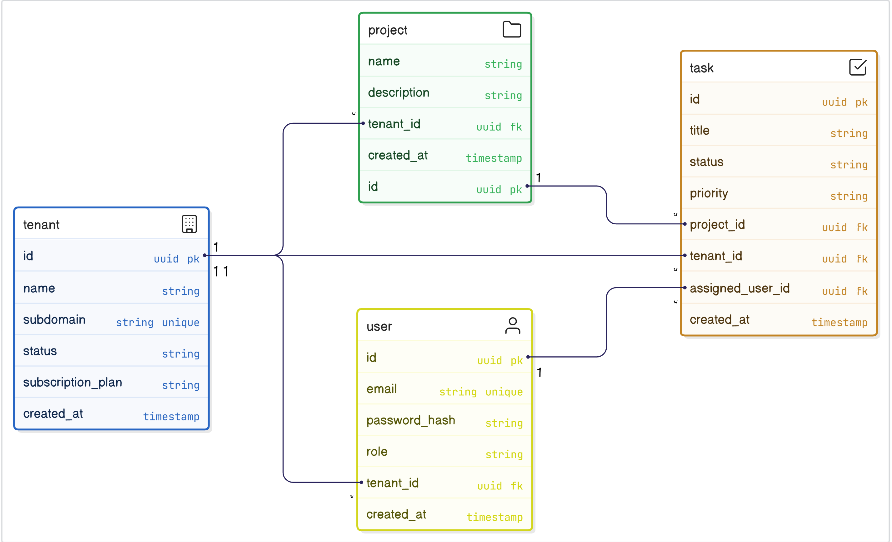

---

# Multi-Tenant SaaS Platform

A fully dockerized **Multi-Tenant SaaS Platform** built with a modern backend and frontend stack, designed to demonstrate **secure multi-tenancy, role-based access control, automatic database initialization, and containerized deployment**.

This project is intended for **automated evaluation** and **real-world SaaS architecture demonstration**, ensuring consistent setup using Docker.

---

## Target Audience

* SaaS platform evaluators
* Backend / Full Stack developers
* Companies assessing multi-tenant system design
* Students demonstrating production-ready SaaS architecture

---

## Features

* Multi-tenant architecture with strict tenant data isolation
* Role-based access control (`super_admin`, `tenant_admin`, `user`)
* Secure authentication using JWT
* Automatic database migrations on startup
* Automatic seed data loading on startup
* PostgreSQL database with persistent Docker volumes
* Fully containerized backend, frontend, and database
* Health check endpoint for service readiness
* Centralized API layer for frontend communication
* Docker Compose single-command startup

---

##  Technology Stack

### Frontend

* React
* Axios
* React Router
* Docker

### Backend

* Node.js
* Express.js
* PostgreSQL
* JWT Authentication
* bcrypt (password hashing)

### Database

* PostgreSQL 15

### DevOps & Tooling

* Docker
* Docker Compose
* Node Package Manager (npm)

---

##  Architecture Overview

This application follows a **three-service architecture**:

1. **Frontend** – UI layer for all users
2. **Backend API** – Authentication, authorization, business logic
3. **Database** – PostgreSQL with tenant-isolated data

All services communicate using **Docker service names**, not `localhost`.

**System Architecture Diagram**


 **Database ERD**


---

## Project Structure

```
multi-tenant-saas-platform/
├── backend/
│   ├── src/
│   ├── migrations/
│   ├── seeds/
│   ├── Dockerfile
│   ├── package.json
│   ├── package-lock.json
│   └── .env.example
│
├── frontend/
│   ├── src/
│   ├── Dockerfile
│   ├── package.json
│   └── package-lock.json
│
├── docs/
│   ├── research.md
│   ├── PRD.md
│   ├── architecture.md
│   ├── technical-spec.md
│   ├── API.md
│   └── images/
│
├── submission.json
├── docker-compose.yml
└── README.md
```

---

##  Dockerized Setup (MANDATORY)

### Prerequisites

* Docker
* Docker Compose

---

###  Run the Application (Single Command)

```bash
docker-compose up -d
```

This command will:

* Start PostgreSQL (`database`)
* Start Backend API (`backend`)
* Start Frontend (`frontend`)
* Automatically run database migrations
* Automatically load seed data

 **No manual commands are required**

---

##  Fixed Port Mappings

| Service  | External Port | Internal Port |
| -------- | ------------- | ------------- |
| Database | 5432          | 5432          |
| Backend  | 5000          | 5000          |
| Frontend | 3000          | 3000          |

---

## Application Access

* Frontend: **[http://localhost:3000](http://localhost:3000)**
* Backend Health Check: **[http://localhost:5000/api/health](http://localhost:5000/api/health)**

Expected health check response:

```json
{
  "status": "ok",
  "database": "connected"
}
```

---

## Environment Variables

All required environment variables are defined **directly in `docker-compose.yml`** to support automated evaluation.

### Backend Variables

| Variable     | Purpose                 |
| ------------ | ----------------------- |
| DB_HOST      | Database service name   |
| DB_PORT      | Database port           |
| DB_NAME      | Database name           |
| DB_USER      | Database user           |
| DB_PASSWORD  | Database password       |
| JWT_SECRET   | JWT signing secret      |
| FRONTEND_URL | Allowed frontend origin |

### Frontend Variables

| Variable          | Purpose              |
| ----------------- | -------------------- |
| REACT_APP_API_URL | Backend API base URL |

---

##  Database Initialization (Automatic)

✔ Database migrations run automatically on backend startup
✔ Seed data loads automatically after migrations
✔ No manual scripts or commands required

Seed data includes:

* 1 Super Admin
* 1 Tenant with Tenant Admin
* At least 1 User per tenant
* At least 1 Project per tenant
* At least 1 Task per project

---

##  Test Credentials

All test credentials are documented in:

```
submission.json
```

The evaluation script uses **exact credentials** from this file.

---

##  API Documentation

Complete API documentation is available here:

*  `docs/API.md`
* OR Swagger/Postman (if applicable)

All **19 API endpoints** are documented with:

* Method
* Endpoint
* Authentication
* Request/Response examples

---

##  Documentation Artifacts

| Document                 | Description                                |
| ------------------------ | ------------------------------------------ |
| `docs/research.md`       | Multi-tenancy research & security analysis |
| `docs/PRD.md`            | Product Requirements Document              |
| `docs/architecture.md`   | Architecture & ERD                         |
| `docs/technical-spec.md` | Technical setup & Docker guide             |
| `docs/API.md`            | Complete API documentation                 |

---

##  Verification Checklist

After running `docker-compose up -d`:

* [x] All 3 services show **Up** (`docker-compose ps`)
* [x] Health check returns **200 OK**
* [x] Frontend loads at `http://localhost:3000`
* [x] Login works with `submission.json` credentials
* [x] Seed data exists in database

---

##  Security & Best Practices

* Passwords hashed using bcrypt
* JWT-based authentication
* Tenant-based query filtering
* Input validation on backend
* Proper role-based authorization
* Docker service isolation
* Persistent database volumes
# multi-tenant-saas
